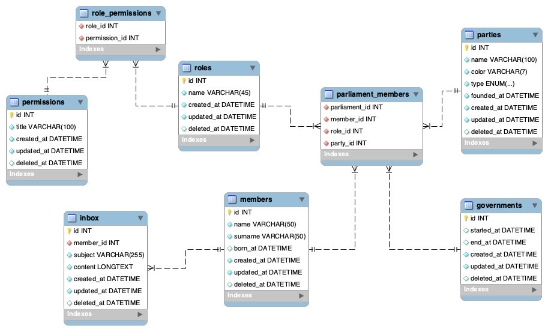

# Django ORM example

This repository demonstrates the use of SQLAlchemy ORM, which use the
[active record](https://en.wikipedia.org/wiki/Active_record_pattern) pattern as architectural design.

The example is based on the data model shown in the figure below. To populate the dataset we used freely available
data from [data.gov.sk](https://data.gov.sk/), which maps the composition of the parliament during the independent
Slovak Republic (since 1993).

Examples are located in the `apps/core/examples` folder. The unfilled version is located in the `presentation` branch.

The project uses [poetry](https://python-poetry.org/) as a packaging system. An example configuration file, with
can be found in the `.env.example` file. A complete Linux installation might look like this, for example:

```shell
# Clone the repository
git clone https://github.com/FIIT-Databases/orm-django-example.git orm_example
cd orm_example

# Set up Python virtual environment and install dependencies
python -m venv venv
source venv/bin/activate
poetry install

# Create configuration
cp .env.example .env
vim .env

# Execute database migrations
python manage.py migrate

# Download up-to-date information on the distribution of parliament
# Good frogs wanna see check apps/core/management/commands/seed.py
python manage.py seed

# Execute tets
python manage.py test
```

## Database



---
With ❤️ FIIT STU
